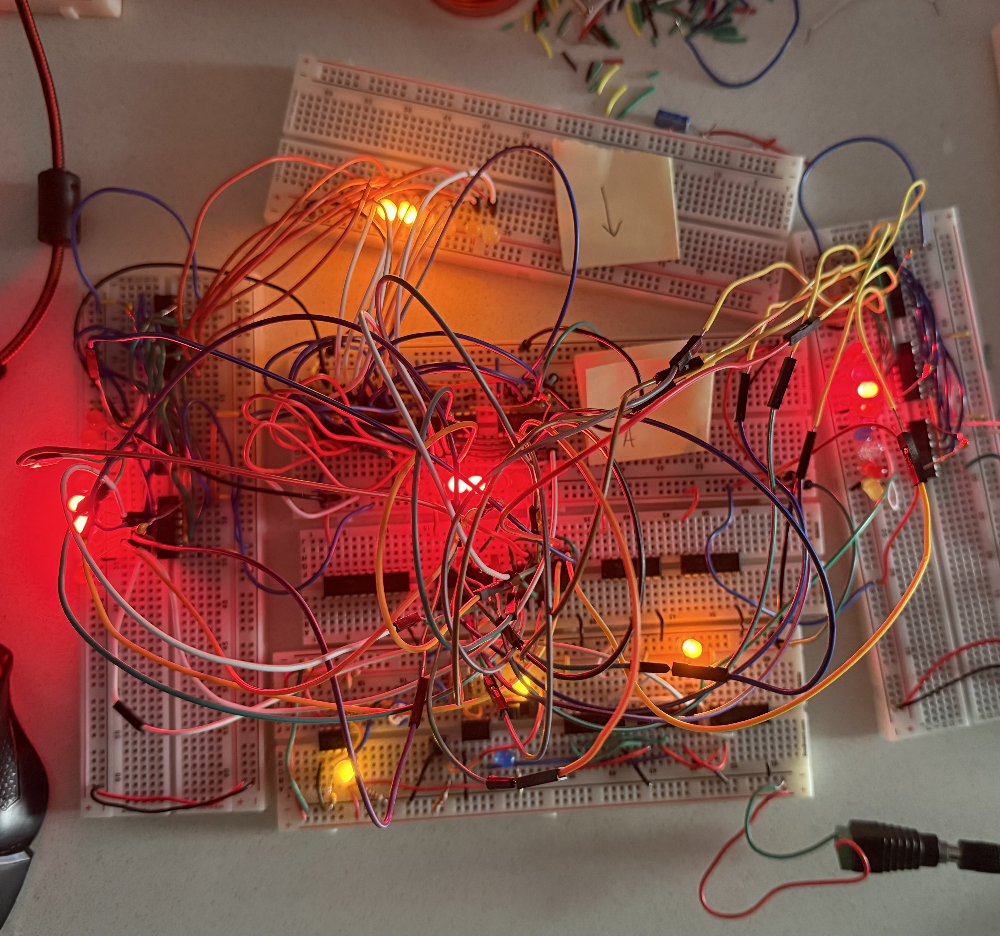

# 8-Bit TTL Computer — Exploring Determinism, Timing, and Physical Computation
Status: Ongoing — intentionally incomplete

## Overview
Built a breadboard based 8-bit computer using TTL logic, following a reference design.  
The goal was not originality, but to understand computation at the **signal, timing, and power** level through hands on implementation and debugging.

This project focuses on *physical computation*: how abstract logic becomes real behavior once voltage, timing, and noise are involved.

## Motivation

Modern digital systems rely on enforced determinism: clean clocks, strict initialization,
wide noise margins, and carefully managed timing.

This project pauses before those constraints are fully imposed in order to observe:
- how state emerges during power up
- how timing and propagation delay influence outcomes
- how registers settle into biased but repeatable states
- where abstraction diverges from physical behavior

These observations are documented as part of understanding computation not just as logic,
but as a physical process.

---

## What I Built
- Clock module (manual + astable)
- Registers with a shared bus
- Tri-state bus architecture
- ALU (basic arithmetic and logic operations) (In Progress 🤗)
- Output / display logic (In Progress 🤗)

---

## What I've Learned So Far
- Power integrity often matters more than schematics
- Floating inputs lead to undefined and unstable behavior
- Registers power up in random states
- Timing and enable signals are physical constraints, not abstractions
- Systems can be functional without being perfectly correct
- Debugging real hardware requires patience and iteration, not just theory

---

## What Didn’t Work (At First)
- Bus contention between multiple registers
- Inconsistent startup states across power cycles
- LED output behaving unpredictably
- Misleading “almost working” states

### Fixes and Adjustments
- Grounding unused enable lines
- Adding decoupling where needed
- Reworking signal flow and control assumptions
- Accepting and designing around imperfect behavior

---

## Status
- Functional but imperfect
- Built for learning and understanding, not polish
- Emphasis on system behavior over correctness

---

### Development Log

(Jan 10, 2026): 

## Clock Module
- Manual pulse and astable clock implemented
- Shared clock line distributed to registers
- Clock behavior verified visually via LED indicators

## Registers
- **Register A** (Center)
- **Register B** (Upper left)
- **ALU Output Register** (Far right breadboard) 
- Registers are implemented as **two 4-bit halves**
- Output Enable (OE) behavior tested and debugged to avoid bus contention
- Registers exhibit realistic behavior including:
  - undefined startup states
  - sensitivity to enable lines
  - need for proper grounding of unused inputs

## Output Register (Testing)
- Output implemented as **two 4 bit registers**
- Used strictly for observing system behavior during early integration
- Current observed output example:

## Bus Architecture
- Shared data bus using tri-state logic
- Multiple registers tested on the same bus
- Learned firsthand how improper OE control causes contention and instability

---

## What This Stage Demonstrates

- Integration of multiple subsystems (clock + registers + bus)
- Real world hardware debugging:
- floating inputs
- enable line conflicts
- inconsistent power-up states
- The physical reality that:
- computation does not start in a “clean” state
- systems can function imperfectly and still be valid

---

(Jan 12, 2026):

## Click here ~~> 

---
(Jan 15, 2026):
## Observations on Startup State, Metastability, and Bias

Current system configuration:
- 555 based clock module
- Two working registers
- Partially implemented ALU
- No forced reset or initialization logic

## Observations
- On power up, registers do not initialize to a fixed state.
- LED outputs exhibit run to run variation when 5V is applied.
- Some bit patterns appear more frequently than others.
- Register states occasionally match output without explicit control.
- Behavior is sensitive to power up timing and clock enable order.

These effects are consistent with:
- propagation delay
- race conditions
- metastability
- physical negotiation of state rather than enforced determinism

## Interpretation
Rather than treating this behavior strictly as a bug to be eliminated,
it is being documented as **unreliable determinism** — a regime where
digital logic begins to expose its physical substrate.

This region of operation is notable because:
- deterministic computation requires active suppression of these effects
- probabilistic and stochastic computation models intentionally operate
  near this boundary instead of eliminating it

## Next Direction (Exploratory)
- Observe and tally startup state frequencies for individual bits
- Change one physical condition at a time (clock speed, power up order, load)
- Document how distributions shift under different conditions

This work does not claim a probabilistic computer yet, but documents
the system operating in a region where **biased outcomes and metastability**
are observable and repeatable.