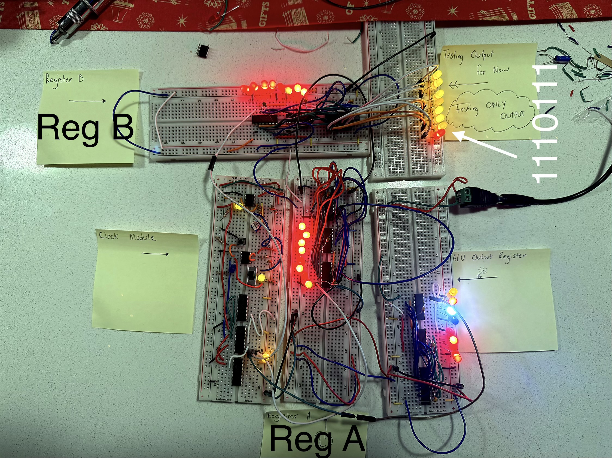

# Discrete 8-Bit Computer (TTL Logic)

## Overview
Built a breadboard-based 8-bit computer using TTL logic, following a reference design.  
The goal was not originality, but to understand computation at the **signal, timing, and power** level through hands on implementation and debugging.

This project focuses on *physical computation*: how abstract logic becomes real behavior once voltage, timing, and noise are involved.

---

## What I Built
- Clock module (manual + astable)
- Registers with a shared bus
- Tri-state bus architecture
- ALU (basic arithmetic and logic operations) (In Progress 🤗)
- Output / display logic (In Progress 🤗)

---

## What I've Learned So Far
- Power integrity often matters more than schematics
- Floating inputs lead to undefined and unstable behavior
- Registers power up in random states
- Timing and enable signals are physical constraints, not abstractions
- Systems can be functional without being perfectly correct
- Debugging real hardware requires patience and iteration, not just theory

---

## What Didn’t Work (At First)
- Bus contention between multiple registers
- Inconsistent startup states across power cycles
- LED output behaving unpredictably
- Misleading “almost working” states

### Fixes and Adjustments
- Grounding unused enable lines
- Adding decoupling where needed
- Reworking signal flow and control assumptions
- Accepting and designing around imperfect behavior

---

## Status
- Functional but imperfect
- Built for learning and understanding, not polish
- Emphasis on system behavior over correctness

---

## Notes
This project is currently being worked on as a self directed learning exercise to develop intuition for
digital systems, hardware debugging, and the realities of physical computation.

---

## Current Progress Snapshot

Below is a snapshot of the system as it exists **at this stage of the build**.  
This image represents a real, working (but imperfect) integration of multiple subsystems.

---

## What Is Implemented So Far: 

(Jan 10, 2026): 

### Clock Module
- Manual pulse and astable clock implemented
- Shared clock line distributed to registers
- Clock behavior verified visually via LED indicators

### Registers
- **Register A** (Center)
- **Register B** (Upper left)
- **ALU Output Register** (Far right breadboard) 
- Registers are implemented as **two 4-bit halves**
- Output Enable (OE) behavior tested and debugged to avoid bus contention
- Registers exhibit realistic behavior including:
  - undefined startup states
  - sensitivity to enable lines
  - need for proper grounding of unused inputs

### Output Register (Testing)
- Output implemented as **two 4 bit registers**
- Used strictly for observing system behavior during early integration
- Current observed output example:

### Bus Architecture
- Shared data bus using tri-state logic
- Multiple registers tested on the same bus
- Learned firsthand how improper OE control causes contention and instability

---

## What This Stage Demonstrates

- Integration of multiple subsystems (clock + registers + bus)
- Real world hardware debugging:
- floating inputs
- enable line conflicts
- inconsistent power-up states
- The physical reality that:
- computation does not start in a “clean” state
- systems can function imperfectly and still be valid

---

## What Is *Not* Implemented Yet

- ALU (currently being built next)
- Control logic / instruction sequencing
- Program counter and instruction decoding
- Memory and full instruction execution

This stage exists specifically to ensure **signal flow, timing, and register behavior** are understood before moving forward.

---

## Status

- System is **partially functional**
- Focus is on learning and understanding, not polish
- Design intentionally left visible and modular for iteration

This snapshot serves as a reference point for future expansion (ALU, control logic, VGA output, etc.).

(Jan 12,2026) -

